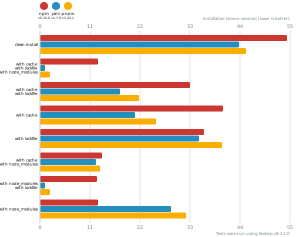
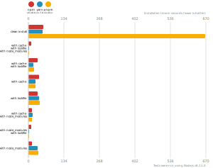

# Node package manager benchmark

This benchmark compares the performance of [npm](https://github.com/npm/npm), [pnpm](https://github.com/pnpm/pnpm) and [yarn](https://github.com/yarnpkg/yarn).

## React app

The app's `package.json` [here](./fixtures/react-app/package.json)

| action  | cache | lockfile | node_modules| npm | Yarn | pnpm |
| ---     | ---   | ---      | ---         | --- | --- | --- |
| install |       |          |             | 54.3s | 43.7s | 45.4s |
| install | ✔    | ✔        | ✔           | 12.8s | 1.2s | 2.3s |
| install | ✔    | ✔        |             | 33.1s | 17.5s | 21.8s |
| install | ✔    |          |             | 40.2s | 20.9s | 25.6s |
| install |      | ✔        |             | 36.1s | 34.9s | 40s |
| install | ✔    |          | ✔           | 13.7s | 12.3s | 13.3s |
| install |      | ✔        | ✔           | 12.6s | 1.1s | 2.3s |
| install |      |          | ✔           | 12.7s | 28.8s | 32.2s |

## Ember app

The app's `package.json` [here](./fixtures/ember-quickstart/package.json)

| action  | cache | lockfile | node_modules| npm | Yarn | pnpm |
| ---     | ---   | ---      | ---         | --- | --- | --- |
| install |       |          |             | 1m 16s | 1m 51.5s | 2m 12.4s |
| install | ✔    | ✔        | ✔           | 11s | 1.1s | 2.2s |
| install | ✔    | ✔        |             | 46.1s | 34.4s | 34.8s |
| install | ✔    |          |             | 51.9s | 44.4s | 38.6s |
| install |      | ✔        |             | 53.4s | 1m 42.4s | 2m 4.2s |
| install | ✔    |          | ✔           | 11.2s | 18.3s | 15.8s |
| install |      | ✔        | ✔           | 10.4s | 1.1s | 2.2s |
| install |      |          | ✔           | 11s | 1m 19.7s | 1m 43.8s |

## Angular app

The app's `package.json` [here](./fixtures/angular-quickstart/package.json)

| action  | cache | lockfile | node_modules| npm | Yarn | pnpm |
| ---     | ---   | ---      | ---         | --- | --- | --- |
| install |       |          |             | 54.8s | 1m 0.9s | 1m 10.2s |
| install | ✔    | ✔        | ✔           | 11.3s | 1.2s | 2.7s |
| install | ✔    | ✔        |             | 37s | 22.4s | 28s |
| install | ✔    |          |             | 41.1s | 33s | 30.6s |
| install |      | ✔        |             | 39.8s | 50.4s | 54.2s |
| install | ✔    |          | ✔           | 12.1s | 19.9s | 15.5s |
| install |      | ✔        | ✔           | 11.5s | 1.1s | 2.4s |
| install |      |          | ✔           | 12.4s | 47.7s | 44.3s |

## Medium Size App

The app's `package.json` [here](./fixtures/medium-size-app/package.json)

| action  | cache | lockfile | node_modules| npm | Yarn | pnpm |
| ---     | ---   | ---      | ---         | --- | --- | --- |
| install |       |          |             | 55.2s | 54.8s | 11m 8s |
| install | ✔    | ✔        | ✔           | 11.7s | 1.1s | 2.4s |
| install | ✔    | ✔        |             | 33.7s | 17.6s | 21.5s |
| install | ✔    |          |             | 39.2s | 27.5s | 25.6s |
| install |      | ✔        |             | 34.9s | 40.8s | 43.6s |
| install | ✔    |          | ✔           | 12.2s | 16.4s | 12.3s |
| install |      | ✔        | ✔           | 11.8s | 1.1s | 2.4s |
| install |      |          | ✔           | 12.2s | 36.1s | 38.3s |

## Lots of Files

The app's `package.json` [here](./fixtures/alotta-files/package.json)

| action  | cache | lockfile | node_modules| npm | Yarn | pnpm |
| ---     | ---   | ---      | ---         | --- | --- | --- |
| install |       |          |             | 1m 9s | 1m 10.2s | 50.3s |
| install | ✔    | ✔        | ✔           | 18.4s | 1.2s | 2.6s |
| install | ✔    | ✔        |             | 41.9s | 33.5s | 22.9s |
| install | ✔    |          |             | 50.5s | 46.4s | 27.4s |
| install |      | ✔        |             | 47.1s | 53.7s | 44.4s |
| install | ✔    |          | ✔           | 12.1s | 27.6s | 15s |
| install |      | ✔        | ✔           | 12.4s | 1.1s | 2.5s |
| install |      |          | ✔           | 12.2s | 39.7s | 35.7s |

